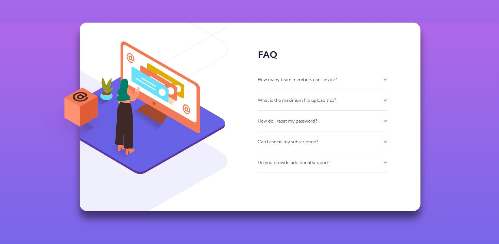

# Frontend Mentor - Faq accordion card solution

This is a solution to the [Faq accordion card challenge on Frontend Mentor](https://www.frontendmentor.io/challenges/faq-accordion-card-XlyjD0Oam). Frontend Mentor challenges help you improve your coding skills by building realistic projects.

## Table of contents

- [Frontend Mentor - Faq accordion card solution](#frontend-mentor---faq-accordion-card-solution)
  - [Table of contents](#table-of-contents)
  - [Overview](#overview)
    - [The challenge](#the-challenge)
    - [Screenshot](#screenshot)
    - [Links](#links)
  - [My process](#my-process)
    - [Built with](#built-with)
    - [What I learned](#what-i-learned)
    - [Continued development](#continued-development)
    - [Useful resources](#useful-resources)
  - [Author](#author)

## Overview

### The challenge

Users should be able to:

- Look as close to the design as possible.
- View the optimal layout for the component depending on their device's screen size
- See hover states for all interactive elements on the page
- Hide/Show the answer to a question when the question is clicked
- Challenge complete without using JavaScript only CSS
- Animated flying box

### Screenshot

### Links

- Solution URL: [https://www.frontendmentor.io/solutions/pseudoelements-sass-semantic-html-t0WkCO_7s](https://www.frontendmentor.io/solutions/pseudoelements-sass-semantic-html-t0WkCO_7s)
- Live Site URL: [https://faq-accordion-eta.vercel.app/](https://faq-accordion-eta.vercel.app/)

## My process

### Built with

- Semantic HTML5 markup
- SASS - BEM based approach
- Mobile-first workflow
- Custom SASS variables
- Pseudo Selectors
- Animations

### What I learned

A lot of work of positioning the elements with pseudo selectors, making it responsive and the accordion work without JS, rotate, transition, the checked selector and animations, this one was a great experience.

### Continued development

After this done, i want to continue using BEM, mobile first , sass and rem unit, pseudo selectors to facilitate the workflow, and transitions, animations.

### Useful resources

- [W3S Animations](hhttps://www.w3schools.com/w3css/w3css_animate.asp) - W3S school animations documentation have all necessary to understand animations workflow.

## Author

- Website - [Samyr Ribeiro](https://samyror.github.io/)
- Frontend Mentor - [@SamyrOR](https://www.frontendmentor.io/profile/SamyrOR)
