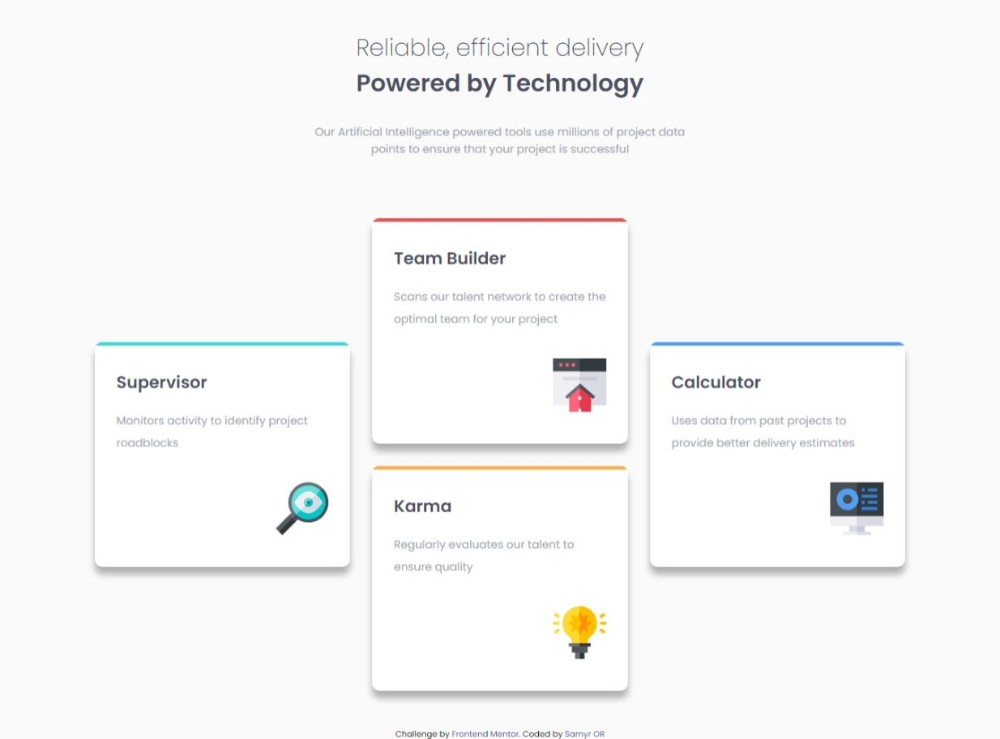

# Frontend Mentor - Four card feature solution

This is a solution to the [Four card feature challenge on Frontend Mentor](https://www.frontendmentor.io/challenges/four-card-feature-section-weK1eFYK). Frontend Mentor challenges help you improve your coding skills by building realistic projects.

## Table of contents

- [Frontend Mentor - Four card feature solution](#frontend-mentor---four-card-feature-solution)
  - [Table of contents](#table-of-contents)
  - [Overview](#overview)
    - [The challenge](#the-challenge)
    - [Screenshot](#screenshot)
    - [Links](#links)
  - [My process](#my-process)
    - [Built with](#built-with)
    - [What I learned](#what-i-learned)
    - [Continued development](#continued-development)
    - [Useful resources](#useful-resources)
  - [Author](#author)

## Overview

### The challenge

Users should be able to:

- Look as close to the design as possible.
- View the optimal layout for the component depending on their device's screen size

### Screenshot

### Links

- Solution URL: [https://www.frontendmentor.io/solutions/responsive-grid-sass-iLfdz-rpz](https://www.frontendmentor.io/solutions/responsive-grid-sass-iLfdz-rpz)
- Live Site URL: [https://four-card-six-henna.vercel.app/](https://four-card-six-henna.vercel.app/)

## My process

### Built with

- Semantic HTML5 markup
- SASS - BEM based approach
- Mobile-first workflow
- Custom SASS variables
- Mixins
- GRID

### What I learned

In this challenge i improved my knowledge about css grid and how implement it, and when to use instead flexbox.

### Continued development

Keep doing great layouts with css grid.

### Useful resources

- [MDN Web Docs grid CSS](https://developer.mozilla.org/en-US/docs/Web/CSS/grid) - This make me better understand the grid.

## Author

- Website - [Samyr Ribeiro](https://samyror.github.io/)
- Frontend Mentor - [@SamyrOR](https://www.frontendmentor.io/profile/SamyrOR)
