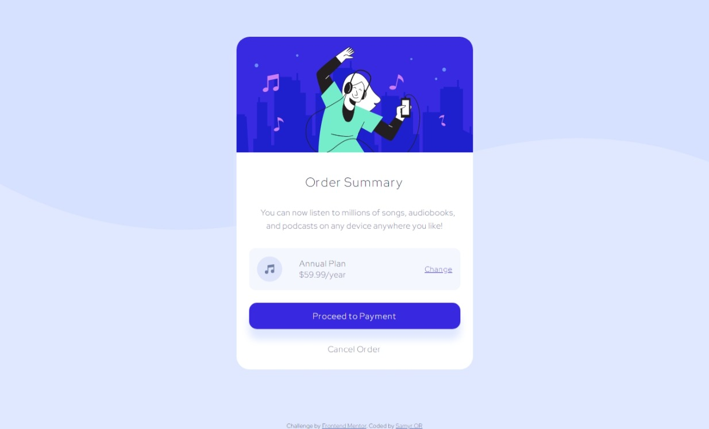

# Frontend Mentor - Order summary component solution

This is a solution to the [Order summary component challenge on Frontend Mentor](https://www.frontendmentor.io/challenges/order-summary-component-QlPmajDUj). Frontend Mentor challenges help you improve your coding skills by building realistic projects.

## Table of contents

- [Frontend Mentor - Order summary component solution](#frontend-mentor---order-summary-component-solution)
  - [Table of contents](#table-of-contents)
  - [Overview](#overview)
    - [The challenge](#the-challenge)
    - [Screenshot](#screenshot)
    - [Links](#links)
  - [My process](#my-process)
    - [Built with](#built-with)
    - [What I learned](#what-i-learned)
    - [Continued development](#continued-development)
    - [Useful resources](#useful-resources)
  - [Author](#author)

## Overview

### The challenge

Users should be able to:

- Look as close to the design as possible.
- View the optimal layout for the component depending on their device's screen size
- See hover states for all interactive elements on the page

### Screenshot

### Links

- Solution URL: [https://www.frontendmentor.io/solutions/mobile-first-html-and-css-8XyQ4x15A](https://www.frontendmentor.io/solutions/mobile-first-html-and-css-8XyQ4x15A)
- Live Site URL: [https://order-summary-kappa.vercel.app/](https://order-summary-kappa.vercel.app/)

## My process

### Built with

- Semantic HTML5 markup
- SASS - BEM based approach
- Mobile-first workflow
- Custom SASS variables
- Mixins
- Transitions and Animations

### What I learned

This challenge my focus was in doing a great card with a smooth and beautiful animation, i think that i archived it, learned and practice the use of `::active` selector at the button to give more feedback on click by the user.

### Continued development

Keep development of great transitions and animations making the page more iterable.

### Useful resources

- [MDN Web Docs Animation](https://developer.mozilla.org/en-US/docs/Web/CSS/animation) - Great article that helped me to understand the bem approach with sass

## Author

- Website - [Samyr Ribeiro](https://samyror.github.io/)
- Frontend Mentor - [@SamyrOR](https://www.frontendmentor.io/profile/SamyrOR)
