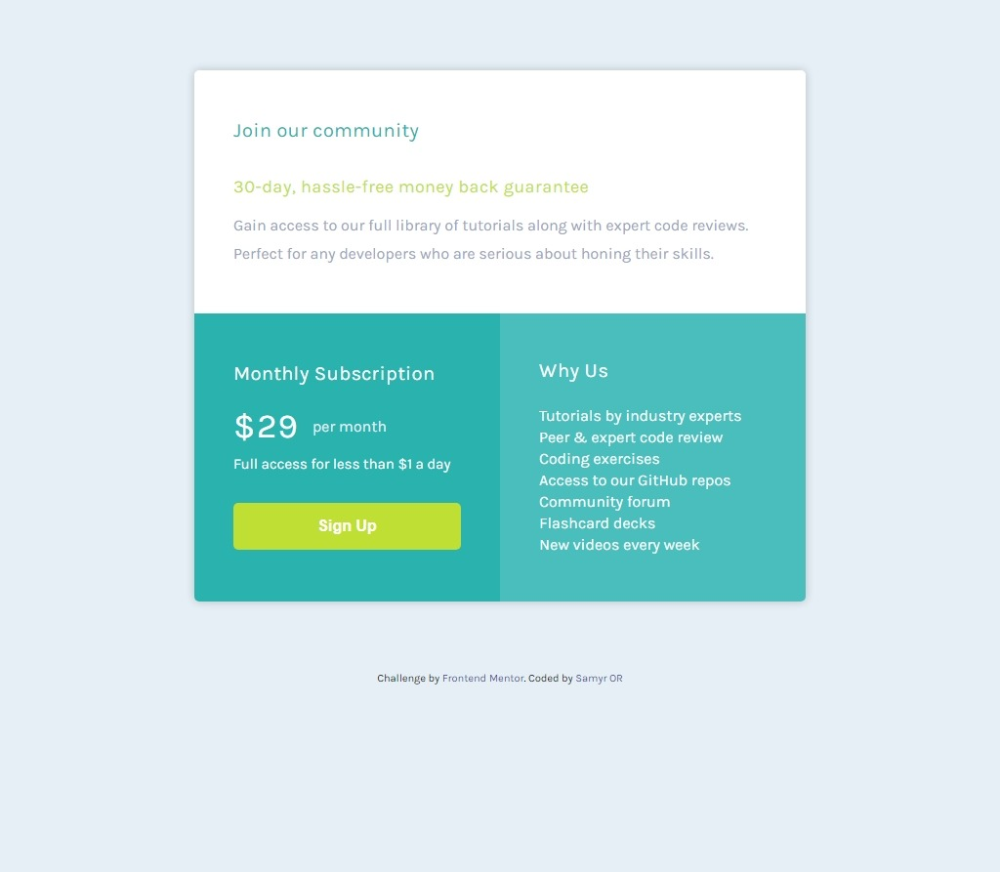

# Frontend Mentor - Single price Grid component solution

This is a solution to the [Single price Grid component challenge on Frontend Mentor](https://www.frontendmentor.io/challenges/single-price-grid-component-5ce41129d0ff452fec5abbbc). Frontend Mentor challenges help you improve your coding skills by building realistic projects.

## Table of contents

- [Frontend Mentor - Single price Grid component solution](#frontend-mentor---single-price-grid-component-solution)
  - [Table of contents](#table-of-contents)
  - [Overview](#overview)
    - [The challenge](#the-challenge)
    - [Screenshot](#screenshot)
    - [Links](#links)
  - [My process](#my-process)
    - [Built with](#built-with)
    - [What I learned](#what-i-learned)
    - [Continued development](#continued-development)
    - [Useful resources](#useful-resources)
  - [Author](#author)

## Overview

### The challenge

Users should be able to:

- Look as close to the design as possible.
- View the optimal layout for the component depending on their device's screen size
- See hover states for interactive **elements**

### Screenshot

### Links

- Solution URL: [https://www.frontendmentor.io/solutions/mobile-first-sass-bem-grid-13mr2ryFN](https://www.frontendmentor.io/solutions/mobile-first-sass-bem-grid-13mr2ryFN)
- Live Site URL: [https://single-price-grid-two-mu.vercel.app/](https://single-price-grid-two-mu.vercel.app/)

## My process

### Built with

- Semantic HTML5 markup
- SASS - BEM based approach
- Custom SASS variables
- Mixins
- Flexbox
- Mobile-first workflow
- Pseudo Elements

### What I learned

Custom variables with sass, mixins and positioning with flexbox elements.

### Continued development

After this done a i want to continue using BEM, mobile first , sass and rem unit into future projects.

### Useful resources

- [https://sass-lang.com/documentation](https://sass-lang.com/documentation) - SASS Documentation helped me a lot while splitting the sass files and using mixins.

## Author

- Website - [Samyr Ribeiro](https://samyror.github.io/)
- Frontend Mentor - [@SamyrOR](https://www.frontendmentor.io/profile/SamyrOR)
