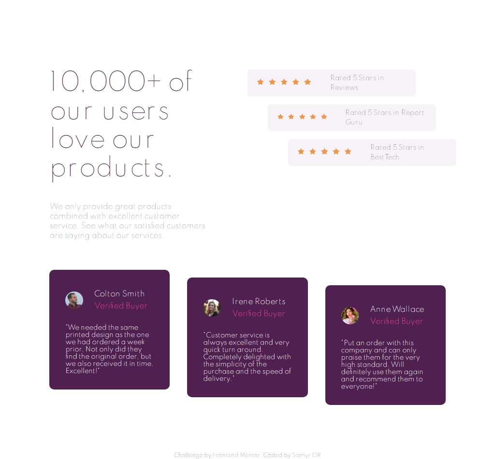

# Frontend Mentor - Social proof section solution

This is a solution to the [Social proof section challenge on Frontend Mentor](https://www.frontendmentor.io/challenges/social-proof-section-6e0qTv_bA). Frontend Mentor challenges help you improve your coding skills by building realistic projects.

## Table of contents

- [Frontend Mentor - Social proof section solution](#frontend-mentor---social-proof-section-solution)
  - [Table of contents](#table-of-contents)
  - [Overview](#overview)
    - [The challenge](#the-challenge)
    - [Screenshot](#screenshot)
    - [Links](#links)
  - [My process](#my-process)
    - [Built with](#built-with)
    - [What I learned](#what-i-learned)
    - [Continued development](#continued-development)
    - [Useful resources](#useful-resources)
  - [Author](#author)

## Overview

### The challenge

Users should be able to:

- Look as close to the design as possible.
- View the optimal layout for the component depending on their device's screen size

### Screenshot

### Links

- Solution URL: [https://www.frontendmentor.io/solutions/full-responsive-grid-scss-AsAWqVZLJ](https://www.frontendmentor.io/solutions/full-responsive-grid-scss-AsAWqVZLJ)
- Live Site URL: [https://social-proof-rho-six.vercel.app/](https://social-proof-rho-six.vercel.app/)

## My process

### Built with

- Semantic HTML5 markup
- SASS - BEM based approach
- Custom SASS variables
- Mixins
- Flexbox
- Grid
- Mobile-first workflow
- Pseudo Selectors

### What I learned

A lot of work of positioning the elements with pseudo selectors and grid usage.

### Continued development

After this done, i want to continue using BEM, mobile first , sass and rem unit into future projects.

### Useful resources

- [https://www.w3schools.com/css/css_grid.asp](hhttps://www.w3schools.com/css/css_grid.asp) - W3S school grid documentation have all necessary to understand grid workflow.

## Author

- Website - [Samyr Ribeiro](https://samyror.github.io/)
- Frontend Mentor - [@SamyrOR](https://www.frontendmentor.io/profile/SamyrOR)
