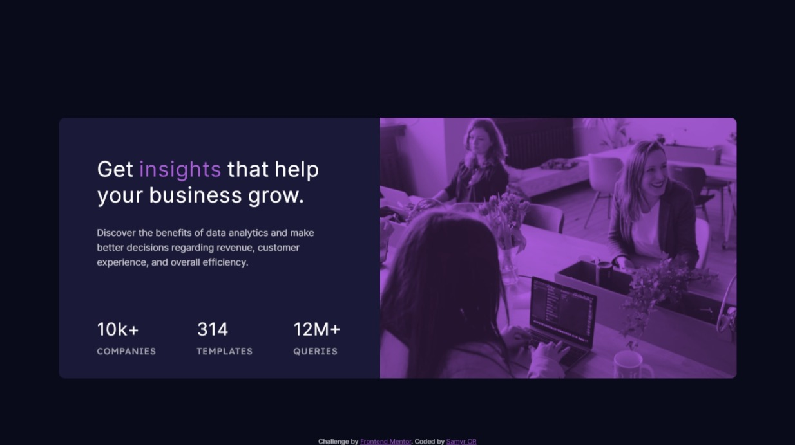

# Frontend Mentor - Stats preview card component solution

This is a solution to the [Stats preview card component challenge on Frontend Mentor](https://www.frontendmentor.io/challenges/stats-preview-card-component-8JqbgoU62). Frontend Mentor challenges help you improve your coding skills by building realistic projects.

## Table of contents

- [Frontend Mentor - Stats preview card component solution](#frontend-mentor---stats-preview-card-component-solution)
  - [Table of contents](#table-of-contents)
  - [Overview](#overview)
    - [The challenge](#the-challenge)
    - [Screenshot](#screenshot)
    - [Links](#links)
  - [My process](#my-process)
    - [Built with](#built-with)
    - [What I learned](#what-i-learned)
    - [Continued development](#continued-development)
    - [Useful resources](#useful-resources)
  - [Author](#author)

## Overview

### The challenge

Users should be able to:

- Look as close to the design as possible.
- View the optimal layout for the component depending on their device's screen size
- See hover states for all interactive elements on the page

### Screenshot

### Links

- Solution URL: [https://www.frontendmentor.io/solutions/html-and-sass-mobile-first-and-bem-bFoDUbvML](https://www.frontendmentor.io/solutions/html-and-sass-mobile-first-and-bem-bFoDUbvML)
- Live Site URL: [https://stats-preview-card-zeta-seven.vercel.app/](https://stats-preview-card-zeta-seven.vercel.app/)

## My process

### Built with

- Semantic HTML5 markup
- SASS - BEM based approach
- Mobile-first workflow
- Custom SASS variables
- Mixins

### What I learned

This was a real big challenge, to match colors from design ant the card photo demanded some hours of research, and the for this i learned how to use `mix-blend-mode: multiply` property from scss, i tried several ways to do with the filter method but was unsuccessfully.

Learned to how to use `@use` sass new import syntax.

### Continued development

Keep the enforcement to create great page even better.

### Useful resources

- [MDN Web Docs Mix blend mode](https://developer.mozilla.org/en-US/docs/Web/CSS/mix-blend-mode) - MDN web docs always a great place to do research and learn new features.

## Author

- Website - [Samyr Ribeiro](https://samyror.github.io/)
- Frontend Mentor - [@SamyrOR](https://www.frontendmentor.io/profile/SamyrOR)
